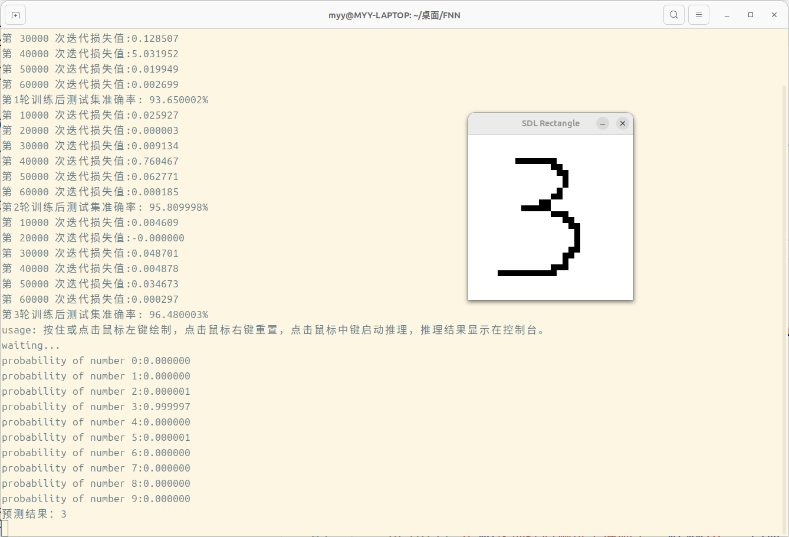

# 2024年6月5日下午15点35分：终于收敛了！！！！！！！

# 简介
写了一个简单的前反馈全连接神经网络，基于单线程x86指令集，未作任何效率优化，仅供学习&好玩用

在演示中（demo.c train.c）使用mnist手写数字数据集进行训练与测试

在demo.c中还使用SDL2图形库实现了一个简单的识别。

但是，由于一方面算法实现不完善，另一方面使用手写数字训练而使用简单的鼠标绘图产生数据进行识别，这个演示不太理想，数字01234578识别较为准确，而数字69经常识别错误。

不过测试集测试勉强还行，正确率一般在96%左右



# 环境
1. 由于demo使用了SDL2图形库，若要使用该功能，需要配置SDL2开发环境，如：

```shell
sudo apt install libstd2-dev
```

2. 项目使用Makefile编译：
```shell
git clone https://github.com/myy5981/FNN.git
cd FNN
make
```

3. 由于项目分别编译为动态库和可执行文件，为了运行时能够找到动态库：

```shell
export LD_LIBRARY_PATH=./bin

or

cp ./bin/libfnn.so /usr/bin
```
